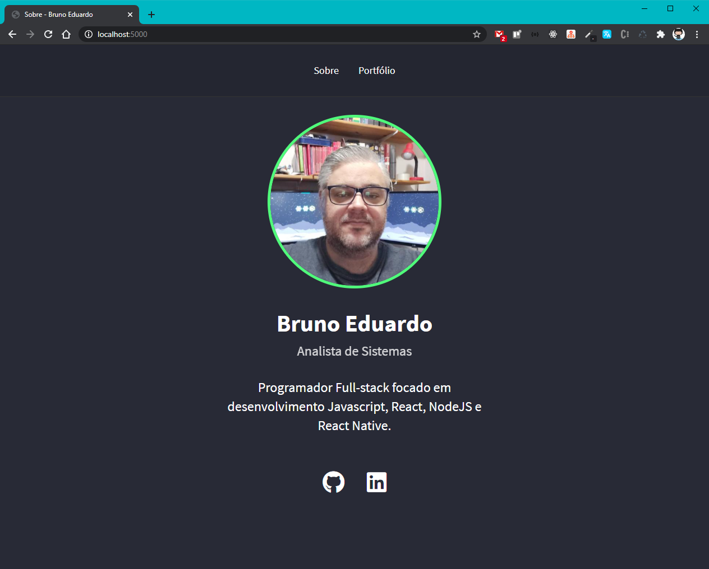
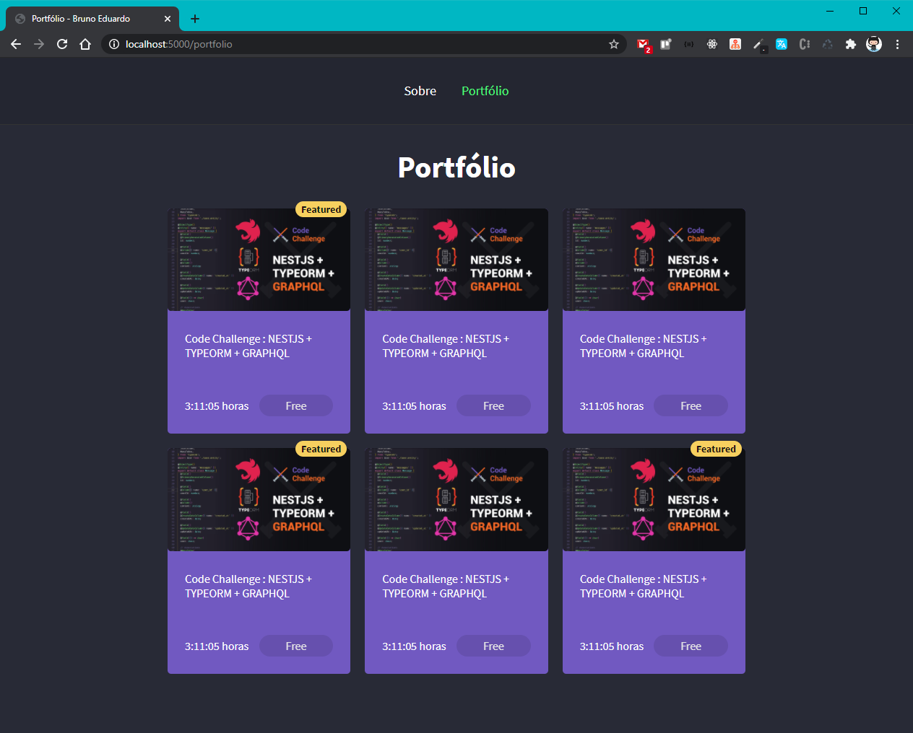
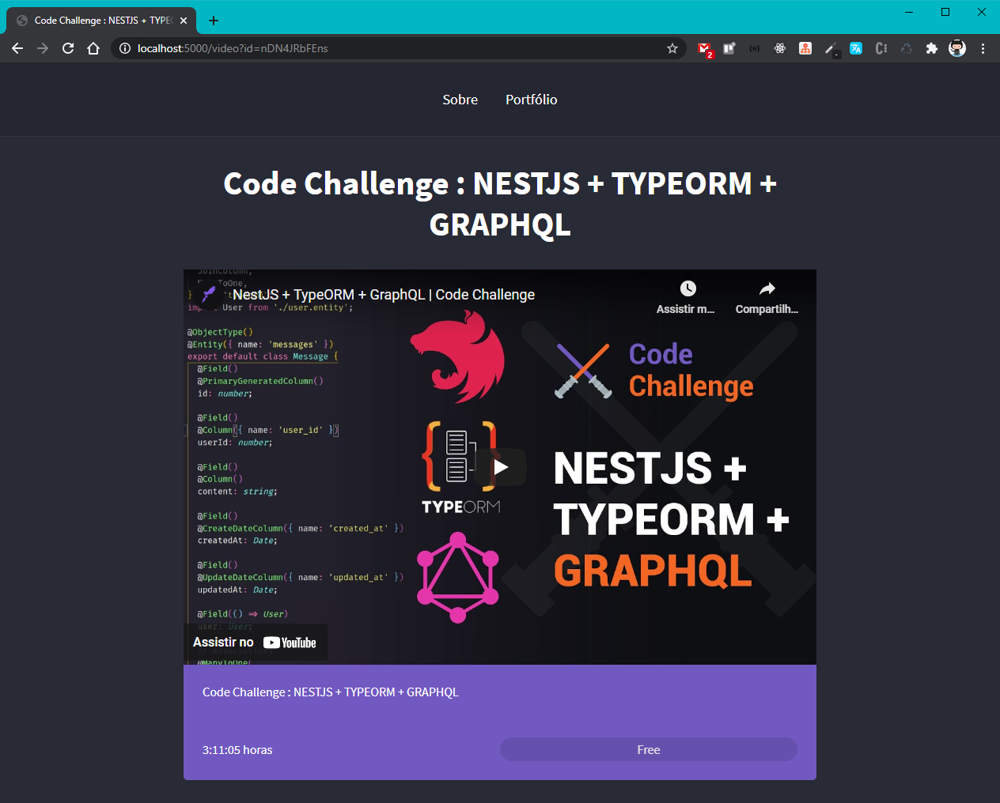

<h1 align="center">
    
</h1>

<h1 align="center">Projeto : Portfólio ( backend / nunjucks )</h1>
<p align="center"></p>

<p align="center">
  <a href="#sobre">Sobre o Projeto</a>&nbsp;&nbsp;&nbsp;|&nbsp;&nbsp;&nbsp;
  <a href="#desafio2">Parte 2: Página de descrição</a>&nbsp;&nbsp;&nbsp;|&nbsp;&nbsp;&nbsp;
  <a href="#desafio3">Parte 3: Página de posts e iframe</a>&nbsp;&nbsp;&nbsp;|&nbsp;&nbsp;&nbsp;
  <a href="#images">Imagens do Desafio Finalizado</a>
</p>

<p align="center">
  <a href="https://rocketseat.com.br">
    
  </a>
  <a href="LICENSE" >
    
  </a>
</p>

<h2 id="sobre"> 🚀 Sobre o Projeto</h2>

Esse projeto de Portfólio foi desenvolvido utilizando nunjuks uma template engine rodando juntamente com um backend em nodejs, consultando dinâmicamente um objeto com dados existente dentro do projeto, para visualização das informações do portfólio e da página Sobre.

<h2 id="images"> 🖼️ Imagens do Desafio Finalizado</h2>

<div align="center">
 
 </ br>
 
  </ br>
 
</div>


### Tecnologias / Dependências
- JavaScript
- HTML
- CSS
- Nunjuks
- Nodemon
- Express


### 🎲 Rodando o Projeto

```bash
# Clone este repositório
$ git clone https://github.com/brunoemferreira/pitu.git

# Acesse a pasta backend
$ cd backend

# execute o comando
$ yarn start
ou
$ npm start

# O servidor inciará na porta:3000
```